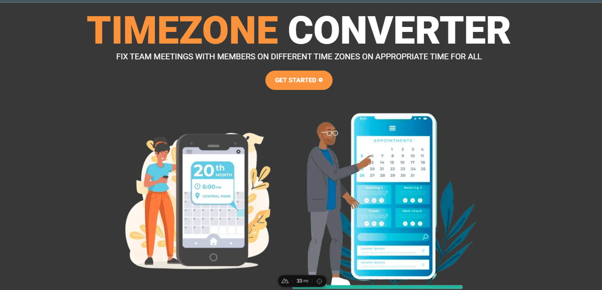

🌍 Timezone Converter
A powerful and intuitive tool for converting time across different timezones with ease.

✨ Features
Multi-Timezone Conversion: Convert time across multiple timezones simultaneously

Intuitive UI: Clean, user-friendly interface for seamless experience

Dark/Light Mode: Supports both dark and light themes

Responsive Design: Works perfectly on all device sizes

Clipboard Support: Copy converted times with a single click

Timezone Database: Comprehensive and up-to-date timezone information

🚀 Quick Start
Clone the repository:

bash
git clone https://github.com/Ollatomiwa/timezone-converter.git
Install dependencies:

bash
npm install
Run the development server:

bash
npm run dev
Open your browser and navigate to http://localhost:3000

🛠️ Technologies Used
Nuxt3: Frontend framework

TypeScript: Type-safe JavaScript

Vite: Blazing fast build tool

Tailwind CSS: Utility-first CSS framework

date-fns: Modern date utility library

Nuxt Icons: Comprehensive icon library

🤝 Contributing
We welcome contributions! Please follow these steps:

Fork the project

Create your feature branch (git checkout -b feature/AmazingFeature)

Commit your changes (git commit -m 'Add some AmazingFeature')

Push to the branch (git push origin feature/AmazingFeature)

Open a Pull Request

📄 License
This project is licensed under the MIT License - see the LICENSE file for details.

🙏 Acknowledgments
Inspired by the challenges of working with remote teams across different timezones

Made with ❤️ by Ollatomiwa
If you find this project useful, please consider giving it a ⭐!
